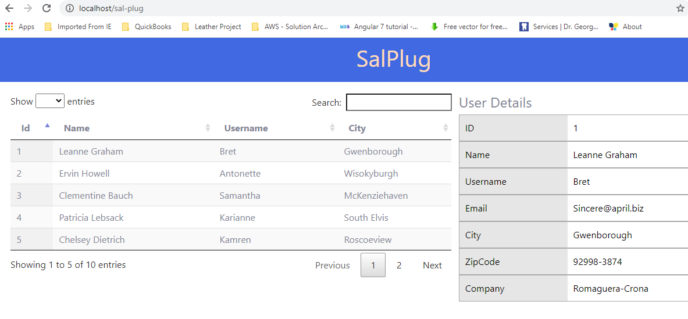
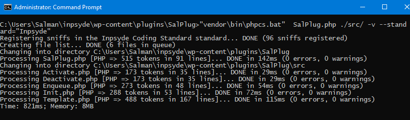
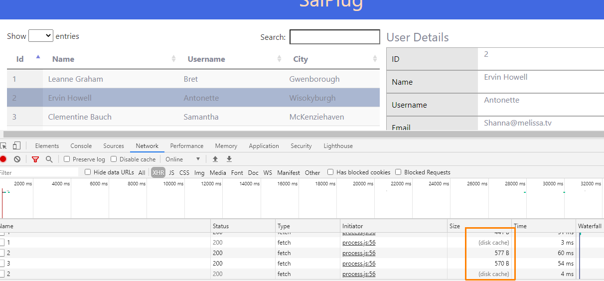

# SalPlug
 > Simple WordPress Plugin to Display 'FETCH'ed API data in a custom endpoint page. The development is initiated via composer init and loads the autoload from the main Plugin file. Uses Bootstrap for responsiveness.


## Custom EndPoint Rendered Screenshot


## Installation

```
$ git clone git@github.com:salmanjaveed/sal-plug.git
$ composer install
```

## Page Access Custom EndPoint

*www.example.com* **/sal-plug**

## Dependencies

  

Required to show table in front-end in custom page

### Dev Dependencies


For Coding Standards - Inpsyde Coding Standards
For Unit Testing -  Brain\Monkey
                    PhpUnit\PhpUnit

## Code Compliance 


This App is Inpsyde Coding Style Compliant



## HTTP Cache

Used **force-cache** with the *fetch* method to cache repeated queries. Screenshot below shows disk cache data retrieval.



## Error Handling

Error Handling is taken care of so as not to hinder the smooth navigation of users when an API *fetch* call fails. The method is appended with a catch and *console.logs* the error.


## Unit Testing


Implemented using Brain\Monkey & Phpunit passes.


